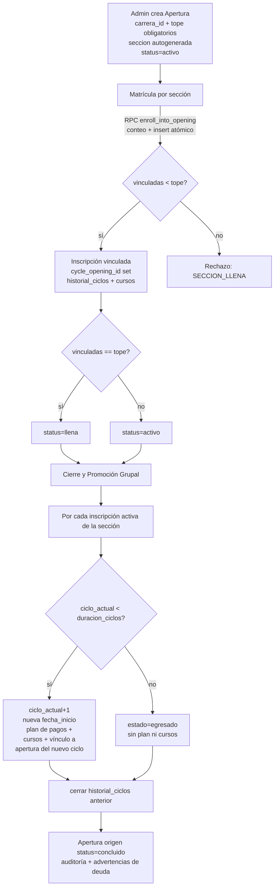

# Documento de Diseño — Gestión de Ciclos y Secciones

## Visión general

Este diseño extiende el manejo actual de ciclos y secciones del sistema I.E.S. Privada Margarita Cabrera para incorporar **cupo por sección (`tope`)**, un **vínculo directo alumna-sección (`cycle_opening_id`)**, un **ciclo de vida de sección** (`activo → llena → concluido`) y una **promoción grupal** que cierra una sección completa y avanza en bloque a todas sus alumnas activas al siguiente ciclo.

El diseño se apoya en el código existente en lugar de reinventarlo:

- **`generateStudentPaymentPlan`** (`src/lib/payment-service.ts`) — ya genera matrícula + cuotas 01-04, aplica la regla de corte de fin de mes (si `start_date` cae el día 16 o después, el primer pago corre al mes siguiente), lee `student_benefits` para descuentos, usa `250` de matrícula y `400` de cuota por defecto y marca `exonerado` cuando el monto es `0`. Recibe `carreraId` para elegir la apertura correcta cuando hay varias del mismo `cycle_number`.
- **`generarCursosCiclo` / `cerrarCursosCiclo`** (`src/lib/generar-cursos-ciclo.ts`) — generan los cursos del ciclo desde la malla y cierran los del ciclo anterior.
- **`proximoLunes` / `esLunes`** (`src/lib/fecha-utils.ts`) — normalizan la fecha de inicio al lunes.
- El patrón de autorización y numeración de sección de **`/api/admin/cycle-openings`** (rangos por carrera: `ACT-SEC=210`, `ACT-IA=80`, `AA=410`, `RRHH=10`, `actualizacion=200`, default `1`).

Cambios estructurales mínimos frente al estado actual:

1. Dos columnas nuevas (`cycle_openings.tope`, `inscripciones.cycle_opening_id`) y ampliación del `status` de la sección.
2. Una **RPC de Postgres** (`enroll_into_opening`) que hace el conteo de cupo + inserción de forma atómica, resolviendo el control de concurrencia (Req 3.7).
3. Un **endpoint de cierre/promoción grupal** que orquesta las funciones ya existentes por cada alumna de la sección.

### Decisión clave — política de deuda (OPCIÓN B)

Las alumnas con `Deuda_Pendiente` **se promueven de todas formas**, registrando una advertencia en el resultado y en `historial_auditoria`, y **conservando las cuotas impagas** del ciclo anterior sin anularlas ni eliminarlas (Req 10).

## Arquitectura

Flujo general: apertura → matrícula → ciclo de vida → cierre/promoción grupal.



### Capas

- **UI (Next.js, `src/app/dashboard/...`)**: `ciclos/page.tsx` (gestión de aperturas, ahora con campo `tope` y botón "Cerrar ciclo y promover") y `usuarios/page.tsx` (matrícula con desplegable de sección mostrando `vinculadas/tope`).
- **API (Route Handlers, `src/app/api/admin/...`)**: validación, autorización y orquestación.
- **Servicios (`src/lib/...`)**: lógica reutilizable de pagos, cursos y fechas.
- **Base de datos (Supabase Postgres)**: tablas + la RPC `enroll_into_opening` que encapsula el control de cupo y concurrencia.

### Control de concurrencia (Req 3.7 y 6.12)

- **Matrícula**: la RPC `enroll_into_opening` toma `SELECT ... FOR UPDATE` sobre la fila de `cycle_openings`, de modo que dos matrículas simultáneas sobre la misma sección se serializan y el conteo nunca supera el `tope`.
- **Promoción grupal**: el endpoint de cierre exige que la apertura esté en `status='activo'` o `'llena'` y realiza como primer paso un cambio de estado condicional a un estado transitorio/`concluido`; una segunda ejecución concurrente encuentra la apertura ya fuera de estado promovible y se rechaza (idempotencia, Req 6.10/6.12).

## Modelos de datos

### Cambios de esquema (SQL exacto)

El archivo de migración idempotente vive en `src/db/gestion-ciclos-secciones-schema.sql`. Fragmentos clave:

```sql
-- Cupo máximo por sección (Req 1, 3, 5)
ALTER TABLE cycle_openings ADD COLUMN IF NOT EXISTS tope INTEGER NOT NULL DEFAULT 20;

-- Vínculo directo alumna-sección (Req 2)
ALTER TABLE inscripciones ADD COLUMN IF NOT EXISTS cycle_opening_id UUID REFERENCES cycle_openings(id);

-- Tope entero >= 1 (Req 1.3)
ALTER TABLE cycle_openings DROP CONSTRAINT IF EXISTS chk_cycle_openings_tope;
ALTER TABLE cycle_openings ADD CONSTRAINT chk_cycle_openings_tope CHECK (tope >= 1);

-- Estados del ciclo de vida (Req 5); 'suspendido' se conserva por la UI actual
ALTER TABLE cycle_openings DROP CONSTRAINT IF EXISTS chk_cycle_openings_status;
ALTER TABLE cycle_openings ADD CONSTRAINT chk_cycle_openings_status
  CHECK (status IN ('activo', 'llena', 'concluido', 'suspendido'));

CREATE INDEX IF NOT EXISTS idx_inscripciones_cycle_opening_id ON inscripciones(cycle_opening_id);
CREATE INDEX IF NOT EXISTS idx_cycle_openings_carrera_ciclo_status
  ON cycle_openings(carrera_id, cycle_number, status);
```

La RPC `enroll_into_opening` (conteo + inserción atómica con `FOR UPDATE`) y el backfill de `cycle_opening_id` se definen completos en el mismo archivo.

### Formas TypeScript actualizadas

```typescript
// cycle_openings
interface CycleOpening {
  id: string;
  cycle_number: number;
  status: "activo" | "llena" | "concluido" | "suspendido";
  start_date: string;        // YYYY-MM-DD
  fecha_fin: string | null;
  seccion: number;           // autogenerado por rango de carrera
  tope: number;              // NUEVO — cupo máximo, entero >= 1
  carrera_id: string;        // ahora obligatorio en la creación
  created_by: string;
  created_at: string;
}

// inscripciones
interface Inscripcion {
  id: string;
  alumno_id: string;
  carrera_id: string;
  ciclo_actual: number;
  fecha_inicio_ciclo: string;
  fecha_matricula: string;
  estado: "activo" | "egresado";
  cycle_opening_id: string | null; // NUEVO — vínculo directo a la sección
  created_at: string;
}

// Respuesta de la RPC enroll_into_opening
interface EnrollResult {
  inscripcion_id: string;
  vinculadas: number;
  tope: number;
  status: "activo" | "llena";
}

// Resultado de la promoción grupal
interface PromocionGrupalResult {
  opening_id: string;
  total_activas: number;
  promovidas: Array<{ alumno_id: string; ciclo_nuevo: number; con_deuda: boolean }>;
  egresadas: string[];       // alumno_id
  omitidas: string[];        // ya promovidas (idempotencia)
  errores: Array<{ alumno_id: string; error: string }>;
  advertencias_deuda: string[]; // alumno_id con Deuda_Pendiente
  status_final: "concluido";
}
```

## Componentes y Endpoints

### 1. `POST /api/admin/cycle-openings` — Apertura (actualizado)

Hace obligatorios `carrera_id` y `tope`; conserva la numeración automática de sección; fija `status='activo'`.

- **Body**: `{ cycle_number: number, carrera_id: string, tope: number, start_date: string, fecha_fin?: string }`
- **Validaciones** (Req 1.1–1.3): rechazar si falta `carrera_id` ("la carrera es obligatoria"), si falta `cycle_number`/`start_date`, o si `tope` no es entero `>= 1`.
- **Respuesta**: `201 { success: true, opening: CycleOpening }`.
- **Auditoría** (Req 1.6): `historial_auditoria.accion = "aperturar_ciclo"` incluyendo `tope` y `seccion`.

### 2. `POST /api/admin/enroll-user` — Matrícula por sección (actualizado)

- **Body**: `{ alumno_id, carrera_id, ciclo, cycle_opening_id, fecha_inicio_ciclo? }` — ahora `cycle_opening_id` es requerido.
- **Flujo**:
  1. Normalizar fecha de inicio con `proximoLunes`/`esLunes`.
  2. Llamar a la RPC `enroll_into_opening(...)` que valida estado de la sección, duplicados (Req 3.6), cupo (Req 3.3), inserta/actualiza la inscripción con `cycle_opening_id` y transiciona a `llena` si corresponde (Req 5.1).
  3. Registrar `historial_ciclos` y generar cursos con `generarCursosCiclo` (Req 3.4).
- **Errores mapeados**: `SECCION_LLENA` → "la sección alcanzó su tope"; `SECCION_NO_ADMITE_MATRICULAS` → "la sección no admite matrículas" (Req 3.5); `MATRICULA_DUPLICADA` → "la alumna ya está matriculada en ese ciclo".
- **Pre-registro (Req 4)**: mismo endpoint; la asignación anticipada usa la misma RPC y control de cupo.

### 3. `GET /api/admin/cycle-openings/available` — Secciones con cupo (nuevo, para el desplegable)

- **Query**: `?carrera_id=...&ciclo=...`
- **Respuesta**: secciones con `status='activo'` de esa carrera/ciclo, cada una con `{ seccion, tope, vinculadas, cupos_disponibles }` para mostrar `vinculadas/tope` en la UI de matrícula (Req 3.1).

### 4. `POST /api/admin/cycle-openings/close` — Cierre y promoción grupal (nuevo, núcleo)

Alias sugerido: `/api/admin/promover-seccion`.

- **Body**: `{ opening_id: string, confirmar: boolean }`
- **Precondiciones** (idempotencia, Req 6.10): si la apertura ya está `concluido`, rechazar sin reprocesar.
- **Flujo**:
  1. Identificar todas las `inscripciones` con `estado='activo'` y `cycle_opening_id = opening_id` (Req 6.1).
  2. Detectar `Deuda_Pendiente` por alumna (cuota con `status` distinto de `paid`/`exonerado` y `due_date` vencida) para las advertencias (Req 10.1/10.2).
  3. Por cada alumna, dentro de un try/catch individual (Req 6.7):
     - Si ya fue promovida (inscripción ya en el ciclo destino o plan del nuevo ciclo existente) → **omitir** (Req 6.11).
     - Si `ciclo_actual >= duracion_ciclos` → marcar `estado='egresado'`, **sin** plan ni cursos, y auditar el egreso (Req 6.4, 9).
     - Si no → `ciclo_actual+1`, nueva `fecha_inicio_ciclo = proximoLunes()`; cerrar `historial_ciclos` anterior (`fecha_fin`, `estado='completado'`, Req 6.6); `cerrarCursosCiclo`; localizar/crear la apertura del nuevo ciclo (Req 8.3) y vincular la inscripción a ella respetando su `tope` (vía `enroll_into_opening` o su lógica de cupo, Req 8.4); `generateStudentPaymentPlan({ alumnoId, ciclo: nuevoCiclo, year, carreraId })` para conservar montos/beneficios (Req 7); `generarCursosCiclo` (Req 8.1).
     - Si tiene `Deuda_Pendiente`: promover igual, **no** tocar sus cuotas impagas, agregar advertencia al resultado y a auditoría (Req 10.3/10.4).
  4. Marcar la apertura origen `status='concluido'` (Req 6.5); si no había alumnas activas, igual concluir y reportarlo (Req 6.9).
  5. Auditar la operación (Req 6.8) y devolver `PromocionGrupalResult`.
- **Apertura del nuevo ciclo**: si no existe una con `status='activo'` para `(carrera_id, cycle_number+1)`, crearla con la numeración de sección por rango de carrera (misma lógica que el endpoint de apertura) y un `tope` por defecto (heredado del origen o `20`).

### 5. `DELETE /api/admin/cycle-openings` — Solo `super_admin` (sin cambios, Req 11.2)

### Componentes de UI

- **`src/app/dashboard/ciclos/page.tsx`**: agregar campo `tope` en el formulario de apertura; mostrar `status` (`activo`/`llena`/`concluido`); botón/modal "Cerrar ciclo y promover" que llama al endpoint de cierre y muestra el resumen (promovidas, egresadas, alumnas con deuda, errores).
- **`src/app/dashboard/usuarios/page.tsx`**: reemplazar el input de ciclo por un desplegable de secciones (`GET .../available`) que muestra `vinculadas/tope` y deshabilita las llenas.

### Control de acceso (Req 11)

Roles `super_admin` y `cycle_manager` para apertura, matrícula, cierre y promoción (mismo `verifyAccess` de `cycle-openings/route.ts`); eliminación de apertura solo `super_admin`.

## Propiedades de Correctitud

*Una propiedad es una característica o comportamiento que debe cumplirse en todas las ejecuciones válidas del sistema — una afirmación formal sobre lo que el sistema debe hacer. Las propiedades son el puente entre las especificaciones legibles por humanos y las garantías de correctitud verificables por máquina.*

### Propiedad 1: El tope nunca se excede

*Para toda* apertura con `tope` T y *para toda* secuencia de intentos de matrícula (incluso simultáneos) sobre esa apertura, la cantidad de inscripciones activas vinculadas por `cycle_opening_id` nunca supera T, y exactamente `min(intentos_válidos, T)` matrículas tienen éxito.

**Validates: Requirements 2.4, 3.2, 3.3, 3.7, 8.4**

### Propiedad 2: Sin matrícula activa duplicada

*Para toda* alumna, carrera y ciclo, no puede existir más de una inscripción con `estado='activo'`; un segundo intento de matrícula en la misma carrera y ciclo se rechaza sin crear un duplicado.

**Validates: Requirements 3.6**

### Propiedad 3: Rechazo de matrícula en secciones no disponibles

*Para toda* apertura cuyo estado sea `llena` o `concluido`, o cuyos `Cupos_Disponibles` sean 0, todo intento de matrícula se rechaza.

**Validates: Requirements 3.3, 3.5, 5.2, 5.5**

### Propiedad 4: Transición a "llena" al alcanzar el tope

*Para toda* apertura, cuando la cantidad de inscripciones activas vinculadas alcanza su `tope`, su `status` pasa a `llena`.

**Validates: Requirements 5.1**

### Propiedad 5: Decisión de promoción vs. egreso

*Para toda* inscripción con `ciclo_actual` C y carrera de duración D: si `C < D` la promoción incrementa `ciclo_actual` en exactamente 1; si `C >= D` la inscripción pasa a `estado='egresado'` sin incrementar el ciclo y sin generar plan ni cursos.

**Validates: Requirements 6.3, 6.4, 9.1, 9.2**

### Propiedad 6: Continuidad de montos y beneficios en la promoción

*Para toda* alumna promovida, cada cuota generada del nuevo ciclo toma el `monto_final` del beneficio activo correspondiente a su tipo de concepto (matrícula/cuota) cuando existe, y el monto por defecto (matrícula 250, cuota 400) cuando no existe.

**Validates: Requirements 7.2, 7.3**

### Propiedad 7: Fechas de vencimiento del plan de pagos

*Para todo* `start_date` de la nueva sección, la matrícula y la cuota 01 vencen el día 01 del mes de inicio y las cuotas 02-04 el día 01 de los meses consecutivos siguientes; si el día de inicio es 16 o posterior, el primer pago se corre al mes siguiente.

**Validates: Requirements 7.4**

### Propiedad 8: Exoneración con monto cero

*Para toda* cuota cuyo monto aplicado sea 0, se registra con `status='exonerado'` y `fecha_pago` con la fecha del proceso.

**Validates: Requirements 7.5**

### Propiedad 9: Idempotencia del cierre grupal

*Para toda* apertura, ejecutar el cierre/promoción grupal dos veces produce el mismo estado final que ejecutarlo una vez: no se crean planes de pago, cursos ni actualizaciones de inscripción duplicados, y la segunda ejecución se rechaza u omite a las alumnas ya promovidas.

**Validates: Requirements 6.10, 6.11, 6.12**

### Propiedad 10: La deuda se conserva en la promoción

*Para toda* alumna con `Deuda_Pendiente` que es promovida, sus cuotas impagas del ciclo anterior permanecen con su `status` sin cambios (no se anulan ni eliminan) y se registra una advertencia asociada a esa alumna en el resultado y en `historial_auditoria`.

**Validates: Requirements 10.3, 10.4, 10.5**

## Estrategia de pruebas

Enfoque dual: **pruebas unitarias** para ejemplos concretos, casos límite y errores; **pruebas basadas en propiedades (PBT)** con `fast-check` para las propiedades universales de la lógica pura. La capa de I/O (Postgres, malla, auditoría) se cubre con pruebas de integración con 1-3 ejemplos representativos.

### Pruebas basadas en propiedades (fast-check, mínimo 100 iteraciones)

Cada test se etiqueta con `// Feature: gestion-ciclos-secciones, Property N: <texto>`.

- **Propiedad 1** (tope nunca se excede): generar `tope` y N intentos de matrícula; la lógica de cupo debe aceptar exactamente `min(válidos, tope)`. La serialización concurrente real se valida además con integración (abajo).
- **Propiedad 5** (promoción vs. egreso): generar pares `(ciclo_actual, duracion_ciclos)` y verificar la decisión (incremento en 1 o egreso).
- **Propiedad 6** (montos/beneficios): generar configuraciones de `student_benefits` y comprobar que cada monto de cuota coincide con el beneficio o el default.
- **Propiedad 7** (fechas de corte): generar `start_date` alrededor del día 16 y en fronteras de mes/año; verificar las 5 fechas de vencimiento y el corrimiento por corte de fin de mes.
- **Propiedad 8** (exoneración): generar beneficios con `monto_final = 0`; verificar `status='exonerado'` con `fecha_pago`.
- **Propiedad 9** (idempotencia): aplicar el cierre dos veces sobre el mismo estado simulado; verificar ausencia de duplicados.
- **Propiedad 10** (deuda conservada): generar inscripciones con cuotas vencidas impagas; tras promover, verificar que esas cuotas quedan intactas y hay advertencia.

Se usará una biblioteca PBT existente (`fast-check`); no se implementará PBT desde cero. Las propiedades 2, 3 y 4 se validan con PBT sobre la lógica de cupo/estado y se complementan con integración sobre la RPC.

### Pruebas unitarias (ejemplos y casos límite)

- Sección con cero alumnas activas: el cierre concluye la apertura y reporta "sin alumnas por promover" (Req 6.9).
- Creación de apertura del nuevo ciclo cuando no existe una activa (Req 8.3).
- Fallo parcial: simular (mock) que una alumna lanza error al generar cursos/plan; verificar que las demás se procesan y el error se colecta (Req 6.7).
- Autorización: cada endpoint responde 403 sin token o con rol no autorizado; `DELETE` solo `super_admin` (Req 11).

### Pruebas de integración (Postgres real/emulado)

- Concurrencia: disparar llamadas concurrentes a `enroll_into_opening` sobre la misma apertura y verificar que el conteo final nunca supera `tope` (Req 3.7, 6.12).
- Cursos y `historial_ciclos`: con malla sembrada, verificar que la promoción crea `alumno_cursos` del nuevo ciclo y cierra el historial anterior.
- Auditoría: verificar la inserción en `historial_auditoria` para apertura, promoción grupal y egreso.

## Manejo de errores

- **Validación de entrada (400)**: `carrera_id`/`cycle_number`/`start_date`/`tope` faltantes; `tope` no entero o `< 1`; `cycle_opening_id` faltante en matrícula.
- **Reglas de negocio desde la RPC**: se mapean los códigos `SECCION_LLENA`, `SECCION_NO_ADMITE_MATRICULAS`, `MATRICULA_DUPLICADA`, `APERTURA_NO_ENCONTRADA` a mensajes en español con el `status` HTTP adecuado (409/400/404).
- **Autorización (403)**: solicitudes sin `Administrador` autorizado; eliminación de apertura por rol distinto de `super_admin`.
- **Idempotencia del cierre**: si la apertura ya está `concluido`, responder con un resultado que lo indique sin reprocesar.
- **Fallo parcial en promoción grupal**: cada alumna se procesa en su propio try/catch; los errores se acumulan en `errores[]` y la operación continúa; el resumen final los expone.
- **Fallo de generación de cursos/plan**: se reporta por alumna sin abortar el lote; el plan duplicado se evita (la propia `generateStudentPaymentPlan` lanza si ya existe y se trata como omisión, Req 7.6).

## Consideraciones de migración

1. **`tope` en aperturas existentes**: la columna se crea con `DEFAULT 20`. Revisar y ajustar manualmente el `tope` real por sección (los rangos por carrera no implican un cupo uniforme). Documentar en la UI de aperturas la edición de `tope`.
2. **Backfill de `cycle_opening_id`**: el script vincula cada inscripción a la apertura que coincida por `carrera_id + ciclo_actual == cycle_number` **solo cuando el vínculo es inequívoco** (exactamente una apertura candidata). Las inscripciones con 0 o más de una apertura candidata quedan sin vincular (`NULL`) para asignación manual desde la UI, evitando vínculos incorrectos cuando existen dos secciones del mismo ciclo/carrera.
3. **Estados**: `cycle_openings.status` amplía su `CHECK` a `('activo','llena','concluido','suspendido')`. Se conserva `suspendido` porque la UI actual (`ciclos/page.tsx`) lo usa al pausar aperturas.
4. **RPC**: `enroll_into_opening` debe crearse antes de habilitar la matrícula por sección; la API pasa a llamarla en lugar de insertar directamente en `inscripciones`.
5. **Orden de despliegue**: (a) ejecutar la migración SQL; (b) hacer el backfill; (c) ajustar `tope`; (d) desplegar la API y la UI. La migración es idempotente y segura de re-ejecutar.
