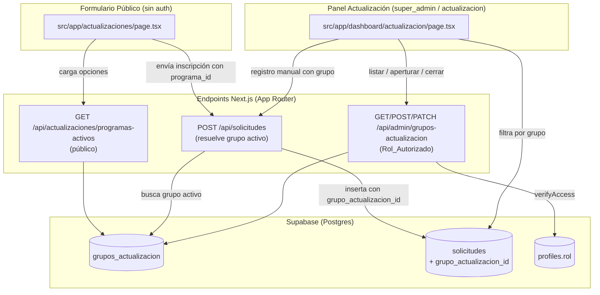
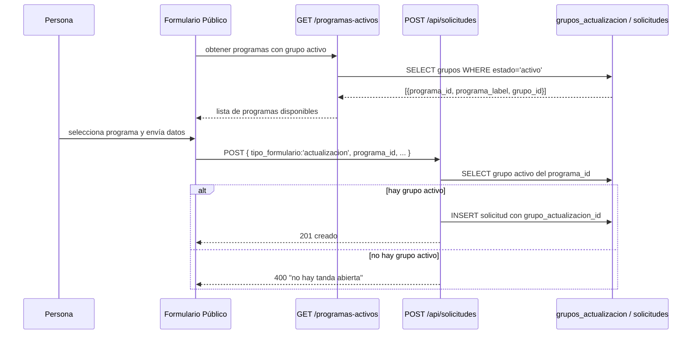

# Documento de Diseño: Grupos de Actualización

## Overview

Esta funcionalidad introduce el concepto de **Grupo de Actualización** (tanda) para separar las inscripciones del módulo de Actualización por tanda, en lugar de mezclarlas todas por programa. El modelo sigue el patrón de "apertura" ya usado por las aperturas de ciclo de carrera (`cycle_openings`), pero de forma más simple: sin cupo (`tope`) ni cursos.

Los pilares del diseño son:

1. Una tabla nueva `grupos_actualizacion` que representa cada tanda (programa + fechas + estado abrir/cerrar).
2. Una columna nueva `grupo_actualizacion_id` (nullable, FK) en `solicitudes` que vincula cada inscripción a su tanda.
3. Un endpoint de administración `/api/admin/grupos-actualizacion` (GET / POST / PATCH) para listar, aperturar y cerrar grupos, autorizado para `super_admin` y `actualizacion`.
4. Un endpoint público `GET /api/actualizaciones/programas-activos` que informa qué programas del catálogo tienen un grupo activo.
5. Cambios en el Formulario Público para ofrecer solo programas con grupo activo y asignar la inscripción al grupo activo automáticamente.
6. Cambios en el Panel de Actualización para filtrar por grupo (incluido histórico de cerrados) y para seleccionar el grupo en el registro manual.

La regla de negocio central es **un solo grupo activo por programa a la vez**, garantizada tanto por lógica de aplicación como por un índice único parcial en la base de datos.

### Investigación y hallazgos clave

Revisión del código existente para reutilizar patrones (no reinventar):

- **Patrón apertura abrir/cerrar**: `src/app/api/admin/cycle-openings/route.ts` usa `verifyAccess` con `ALLOWED_ROLES`, lee `profiles.rol` vía `supabaseAdmin`, con fallback al correo `admin@margaritacabrera.edu.pe`, e inserta en `cycle_openings` con `status`, `created_by` y registro en `historial_auditoria`. Los grupos de actualización replican este patrón con `ALLOWED_ROLES = ["super_admin", "actualizacion"]`.
- **Catálogo de programas**: `ACTUALIZACIONES_CATALOGO` en `src/lib/mock-data.ts` (ids `ac1`/`ac2`, `label`, `costo`, `codigoNubefact`, etc.). Es la fuente de verdad de los programas; los grupos referencian `programa_id` (ej. `ac1`) y guardan `programa_label` para mostrar sin depender del catálogo en consultas.
- **Formulario público**: `src/app/actualizaciones/page.tsx` lista `ACTUALIZACIONES_CATALOGO` en un `<select>` y hace `POST /api/solicitudes` con `tipo_formulario: "actualizacion"` y `tipo_tramite: actualizacion.label`. Debe pasar a consumir la API de programas activos y enviar el `programa_id` para que el backend resuelva el grupo activo.
- **Inserción pública de solicitudes**: `src/app/api/solicitudes/route.ts` (`POST`) inserta con `supabaseAdmin`. Aquí es donde se resuelve el grupo activo y se rellena `grupo_actualizacion_id` cuando `tipo_formulario === "actualizacion"`.
- **Panel admin**: `src/app/dashboard/actualizacion/page.tsx` (`RouteGuard allowedRoles={["super_admin","actualizacion"]}`) tiene pestañas por programa (`ACTUALIZACIONES_CATALOGO`) y un modal `RegistroManualModal`. Se añade un filtro por grupo y un selector de grupo en el modal.
- **Rol `actualizacion`**: definido en `src/lib/auth-context.tsx` (correo `milnarvaez@margaritacabrera.edu.pe`). El panel ya lo permite.
- **Migración con backfill**: `src/db/gestion-ciclos-secciones-schema.sql` es el patrón para migraciones idempotentes (`ADD COLUMN IF NOT EXISTS`, `CREATE INDEX IF NOT EXISTS`) que el usuario corre en el SQL Editor de Supabase.

## Architecture



### Flujo: inscripción pública



## Components and Interfaces

### 1. Base de datos (migración SQL)

Archivo nuevo: `src/db/grupos-actualizacion-schema.sql` (migración idempotente que el usuario ejecuta en Supabase). Ver sección **Data Models** para el detalle del esquema.

### 2. API_Grupos — `/api/admin/grupos-actualizacion` (archivo `src/app/api/admin/grupos-actualizacion/route.ts`)

Sigue el patrón `verifyAccess` de `cycle-openings`.

```ts
const ALLOWED_ROLES = ["super_admin", "actualizacion"];

// Autoriza si el token corresponde a admin@margaritacabrera.edu.pe
// o a un profiles.rol dentro de ALLOWED_ROLES.
async function verifyAccess(req: NextRequest): Promise<User | null>;
```

- **GET** `/api/admin/grupos-actualizacion`
  - Query opcional `?programa_id=ac1` para filtrar por programa.
  - Respuesta: `{ grupos: GrupoActualizacionDB[] }` ordenados por `created_at` descendente.
- **POST** `/api/admin/grupos-actualizacion`
  - Body: `{ programa_id, fecha_inicio, fecha_cierre_inscripcion }`.
  - Valida que `programa_id` exista en `ACTUALIZACIONES_CATALOGO` y que `fecha_inicio` sea válida (Req 1.4, 1.5).
  - Valida que no exista ya un grupo `activo` para ese programa (Req 1.3). La verificación de aplicación se apoya en un índice único parcial en BD como salvaguarda ante concurrencia.
  - Inserta con `estado='activo'`, `programa_label` derivado del catálogo, `created_by = user.id`.
  - Registra en `historial_auditoria` (`accion: "aperturar_grupo_actualizacion"`).
  - Respuesta: `201 { success: true, grupo }`.
- **PATCH** `/api/admin/grupos-actualizacion`
  - Body: `{ id, estado: "cerrado" }` (cierre manual, Req 2.1) o `{ id, grupo_actualizacion_id... }` para futuras ediciones de fechas.
  - Si el grupo ya está `cerrado`, responde indicando que ya está cerrado (Req 2.5).
  - Registra en `historial_auditoria` (`accion: "cerrar_grupo_actualizacion"`).
  - Respuesta: `{ success: true }`.

### 3. API_Programas_Activos — `GET /api/actualizaciones/programas-activos` (archivo `src/app/api/actualizaciones/programas-activos/route.ts`)

- Endpoint **público** (sin auth), de solo lectura.
- Consulta los grupos con `estado='activo'` y devuelve, por cada uno, el programa y el `grupo_id` para que el formulario pueda enviar el `programa_id`.
- Respuesta: `{ programas: Array<{ programa_id, programa_label, grupo_id, fecha_inicio, fecha_cierre_inscripcion }> }`.
- Solo se incluye un programa si tiene exactamente un grupo activo (Req 3.1, 3.4). El índice único parcial garantiza que nunca haya más de uno.

### 4. Inserción de solicitudes — `POST /api/solicitudes` (modificación de `src/app/api/solicitudes/route.ts`)

- Si `body.tipo_formulario === "actualizacion"`:
  - Determina el `programa_id`. El formulario envía `programa_id`; como respaldo, si solo llega `tipo_tramite` (label), se resuelve el `programa_id` desde `ACTUALIZACIONES_CATALOGO`.
  - Busca el grupo `activo` del programa en `grupos_actualizacion`.
  - Si no hay grupo activo → responde `400` con mensaje "No hay una tanda abierta para este programa" (Req 4.2).
  - Si hay grupo activo → inserta la solicitud con `grupo_actualizacion_id = grupo.id` (Req 4.1, 4.3).
- Para `tipo_formulario` distinto de `"actualizacion"`, el comportamiento no cambia (retrocompatibilidad).

### 5. Formulario Público (modificación de `src/app/actualizaciones/page.tsx`)

- Al montar, llama a `GET /api/actualizaciones/programas-activos` y guarda la lista en estado.
- El `<select>` de programas se llena con los programas activos devueltos, no con `ACTUALIZACIONES_CATALOGO` completo (Req 3.2).
- Si la lista viene vacía, muestra un aviso "No hay programas disponibles para inscripción en este momento" y deshabilita el envío (Req 3.3).
- Al enviar, incluye `programa_id` en el body de `POST /api/solicitudes`.
- El costo/`label` para mostrar se siguen leyendo del catálogo cruzando por `programa_id` (el catálogo mantiene precios y datos de Nubefact).

### 6. Panel de Actualización (modificación de `src/app/dashboard/actualizacion/page.tsx`)

- **Servicio nuevo** `src/lib/grupos-actualizacion-service.ts`: funciones `getGrupos()`, `aperturarGrupo(...)`, `cerrarGrupo(id)`, `asignarGrupoASolicitud(solicitudId, grupoId)` que llaman a la API_Grupos con el token de sesión (patrón de `solicitudes-service.ts`).
- **Filtro por grupo**: dentro de cada pestaña de programa, un selector de grupo (`activo` y `cerrado`) más una opción "Sin agrupar" (Req 6.1–6.4). Al seleccionar, filtra `todas` por `grupo_actualizacion_id`.
- **Indicador "vencido"**: para grupos `activo` con `fecha_cierre_inscripcion < hoy`, se muestra una etiqueta "Vencido" (Req 2.3), sin cerrarlos automáticamente.
- **Gestión de grupos**: sección/modal para aperturar (elegir programa, fecha inicio, fecha cierre) y cerrar grupos. Disponible para `super_admin` y `actualizacion`.
- **Registro manual** (`RegistroManualModal`): se añade un `<select>` de grupo (requerido). El `tipo_tramite` se deriva del programa del grupo seleccionado (Req 5.1–5.4). Se envía `grupo_actualizacion_id` explícito.
- **Asignar grupo a inscripción sin agrupar**: acción por fila que llama a `asignarGrupoASolicitud` (Req 8.5).

### 7. Permisos

- API_Grupos: `ALLOWED_ROLES = ["super_admin", "actualizacion"]` + fallback correo admin (Req 7.1–7.3).
- Panel: `RouteGuard` ya usa `["super_admin", "actualizacion"]` (Req 7.4), sin cambios.

## Data Models

### Tabla `grupos_actualizacion` (nueva)

| Columna                    | Tipo         | Restricciones                                             | Descripción |
|----------------------------|--------------|-----------------------------------------------------------|-------------|
| `id`                       | `UUID`       | PK, `DEFAULT gen_random_uuid()`                           | Identificador del grupo. |
| `programa_id`              | `TEXT`       | `NOT NULL`                                                | Id del catálogo (`ac1`, `ac2`). |
| `programa_label`           | `TEXT`       | `NOT NULL`                                                | Nombre del programa para mostrar. |
| `fecha_inicio`             | `DATE`       | `NOT NULL`                                                | Fecha de inicio de la tanda. |
| `fecha_cierre_inscripcion` | `DATE`       | `NULL` permitido                                          | Fecha límite informativa de inscripción. |
| `estado`                   | `TEXT`       | `NOT NULL DEFAULT 'activo'`, `CHECK (estado IN ('activo','cerrado'))` | Estado del grupo (Req 8.6). |
| `created_by`               | `UUID`       | `NULL` permitido                                          | Usuario que creó el grupo. |
| `created_at`               | `TIMESTAMPTZ`| `NOT NULL DEFAULT now()`                                  | Fecha de creación. |

**Índice único parcial (regla "un solo grupo activo por programa", Req 1.3):**

```sql
CREATE UNIQUE INDEX IF NOT EXISTS uq_grupos_actualizacion_activo_por_programa
  ON grupos_actualizacion (programa_id)
  WHERE estado = 'activo';
```

Este índice garantiza a nivel de base de datos que no puedan coexistir dos grupos `activo` del mismo `programa_id`, incluso ante inserciones concurrentes.

### Columna nueva en `solicitudes`

```sql
ALTER TABLE solicitudes
  ADD COLUMN IF NOT EXISTS grupo_actualizacion_id UUID REFERENCES grupos_actualizacion(id);

CREATE INDEX IF NOT EXISTS idx_solicitudes_grupo_actualizacion_id
  ON solicitudes(grupo_actualizacion_id);
```

- Nullable: las inscripciones sin tanda quedan "sin agrupar" (Req 8.2, 8.3).
- Las inscripciones de actualización previas se conservan con `grupo_actualizacion_id = NULL` (Req 8.4). **No se hace backfill automático**, porque históricamente no existía el concepto de tanda y asignarlas por adivinanza sería incorrecto; el diseño prefiere dejarlas "sin agrupar" y permitir su asignación manual (Req 8.5).

### Tipos TypeScript

En `src/lib/supabase.ts` se amplía `SolicitudDB`:

```ts
export interface SolicitudDB {
  // ...campos existentes...
  grupo_actualizacion_id?: string | null;
}
```

Nuevo tipo (en `src/lib/supabase.ts` o en el servicio nuevo):

```ts
export interface GrupoActualizacionDB {
  id?: string;
  programa_id: string;         // 'ac1' | 'ac2' | ...
  programa_label: string;
  fecha_inicio: string;        // ISO date
  fecha_cierre_inscripcion?: string | null;
  estado: "activo" | "cerrado";
  created_by?: string | null;
  created_at?: string;
}
```

### Migración SQL (marcar para ejecutar en Supabase)

> **Acción del usuario:** ejecutar el siguiente script en el **SQL Editor de Supabase**. Es idempotente y seguro de re-ejecutar.

```sql
-- ============================================================
-- Módulo Grupos de Actualización: migración de esquema
-- ============================================================

-- 1. Tabla de grupos (tandas)
CREATE TABLE IF NOT EXISTS grupos_actualizacion (
  id                       UUID PRIMARY KEY DEFAULT gen_random_uuid(),
  programa_id              TEXT NOT NULL,
  programa_label           TEXT NOT NULL,
  fecha_inicio             DATE NOT NULL,
  fecha_cierre_inscripcion DATE,
  estado                   TEXT NOT NULL DEFAULT 'activo',
  created_by               UUID,
  created_at               TIMESTAMPTZ NOT NULL DEFAULT now()
);

-- 2. Estados válidos (Req 8.6)
ALTER TABLE grupos_actualizacion DROP CONSTRAINT IF EXISTS chk_grupos_actualizacion_estado;
ALTER TABLE grupos_actualizacion ADD CONSTRAINT chk_grupos_actualizacion_estado
  CHECK (estado IN ('activo', 'cerrado'));

-- 3. Un solo grupo activo por programa (Req 1.3)
CREATE UNIQUE INDEX IF NOT EXISTS uq_grupos_actualizacion_activo_por_programa
  ON grupos_actualizacion (programa_id)
  WHERE estado = 'activo';

-- 4. Vínculo inscripción -> grupo (nullable, Req 8.2 / 8.3)
ALTER TABLE solicitudes
  ADD COLUMN IF NOT EXISTS grupo_actualizacion_id UUID REFERENCES grupos_actualizacion(id);

CREATE INDEX IF NOT EXISTS idx_solicitudes_grupo_actualizacion_id
  ON solicitudes(grupo_actualizacion_id);

-- NOTA: las inscripciones de actualización previas quedan con
-- grupo_actualizacion_id = NULL ("sin agrupar"). No se realiza backfill
-- automático; se asignan manualmente desde el panel (Req 8.4 / 8.5).
```

## Correctness Properties

*Una propiedad es una característica o comportamiento que debe cumplirse en todas las ejecuciones válidas de un sistema; esencialmente, una afirmación formal sobre lo que el sistema debe hacer. Las propiedades son el puente entre las especificaciones legibles por humanos y las garantías de corrección verificables por máquina.*

Estas propiedades aplican a la **lógica pura** extraíble del backend (resolución del grupo activo, validación de apertura, transición de estado), probada con mocks del acceso a datos. La capa de I/O (Supabase, red) se cubre con pruebas de integración/ejemplo, no con PBT.

### Property 1: A lo sumo un grupo activo por programa

*Para cualquier* secuencia de aperturas de grupos sobre un mismo `programa_id`, después de aplicar la validación de apertura el número de grupos con estado `activo` para ese programa nunca es mayor que uno.

**Validates: Requisitos 1.1, 1.3**

### Property 2: La inscripción pública se asigna al grupo activo del programa

*Para cualquier* programa que tenga un grupo `activo`, una inscripción pública para ese programa produce una Solicitud cuyo `grupo_actualizacion_id` es igual al `id` del grupo `activo` de ese programa.

**Validates: Requisitos 4.1, 4.3**

### Property 3: Sin grupo activo se rechaza la inscripción

*Para cualquier* programa que no tenga ningún grupo `activo`, un intento de inscripción pública para ese programa es rechazado y no crea ninguna Solicitud vinculada.

**Validates: Requisitos 4.2, 3.3**

### Property 4: El formulario solo ofrece programas con grupo activo

*Para cualquier* conjunto de grupos, la lista de programas devuelta por la API_Programas_Activos contiene exactamente los `programa_id` que tienen al menos un grupo `activo`, y ninguno sin grupo activo.

**Validates: Requisitos 3.1, 3.2, 3.4**

### Property 5: Cerrar es idempotente y bloquea nuevas vinculaciones

*Para cualquier* grupo, cerrarlo una vez lo deja en estado `cerrado`, y cerrarlo de nuevo mantiene el estado `cerrado`; además, mientras un grupo está `cerrado` ninguna inscripción nueva puede quedar vinculada a él.

**Validates: Requisitos 2.1, 2.2, 2.5**

### Property 6: La validez del "vencido" no cierra el grupo

*Para cualquier* grupo `activo` cuya `fecha_cierre_inscripcion` sea anterior a la fecha actual, el cálculo del indicador "vencido" es verdadero y el estado del grupo permanece `activo` (no cambia a `cerrado`).

**Validates: Requisitos 2.3, 2.4**

### Property 7: El registro manual respeta el grupo seleccionado

*Para cualquier* grupo seleccionado en el registro manual, la Solicitud creada tiene `grupo_actualizacion_id` igual al grupo seleccionado y su `tipo_tramite` igual al `programa_label` de ese grupo.

**Validates: Requisitos 5.2, 5.4**

## Error Handling

- **Apertura duplicada (Req 1.3):** la validación de aplicación responde `400` con mensaje claro; el índice único parcial es la salvaguarda ante carreras de concurrencia y, si dispara, se traduce a un `400` "Ya existe un grupo activo para este programa".
- **Validación de apertura (Req 1.4, 1.5):** `programa_id` inexistente en el catálogo o fecha de inicio inválida → `400` con mensaje de validación.
- **Inscripción sin tanda abierta (Req 4.2):** `POST /api/solicitudes` para un programa sin grupo activo → `400` "No hay una tanda abierta para este programa"; no se inserta nada.
- **Cierre de grupo ya cerrado (Req 2.5):** `PATCH` responde indicando que el grupo ya está cerrado (sin error fatal).
- **No autorizado (Req 7.3):** cualquier operación de la API_Grupos sin Rol_Autorizado → `403 "No autorizado"`.
- **Errores de base de datos:** se devuelven con `500` y el mensaje del error, siguiendo el patrón de `cycle-openings`.
- **Registro manual sin grupo (Req 5.3):** el formulario del panel deshabilita el guardado hasta que se seleccione un grupo (validación de cliente) y el backend rechaza con `400` si falta.

## Testing Strategy

Enfoque dual: pruebas unitarias/de ejemplo para casos concretos e integración, y pruebas basadas en propiedades (PBT) para la lógica pura.

### Pruebas basadas en propiedades (PBT)

- Aplica a la **lógica pura** extraída del backend: resolución del grupo activo por programa, validación de apertura (un solo activo), transición de cierre y cálculo del indicador "vencido". Estas funciones deben escribirse sin dependencias directas de Supabase (recibir los datos como argumentos o usar un repositorio mockeable) para poder ejercitarlas con muchos inputs.
- Librería sugerida: **fast-check** (ecosistema TypeScript/Jest o Vitest). No implementar PBT desde cero.
- Configuración: mínimo **100 iteraciones** por propiedad.
- Etiqueta por prueba: `// Feature: grupos-actualizacion, Property {número}: {texto}`.
- Cada propiedad de la sección **Correctness Properties** se implementa con una única prueba basada en propiedades.

### Pruebas unitarias / de ejemplo

- Validación de apertura: casos de `programa_id` inválido y fecha inválida (Req 1.4, 1.5).
- Cierre de un grupo ya cerrado (Req 2.5).
- `POST /api/solicitudes` con y sin grupo activo (Req 4.1, 4.2), usando mocks del cliente de Supabase.
- Autorización de la API_Grupos: token de `super_admin`, de `actualizacion`, del correo admin, y no autorizado (Req 7.1–7.3).

### Pruebas de integración

- Migración SQL aplicada sobre un entorno de prueba y verificación de que el índice único parcial rechaza dos grupos activos del mismo programa (Req 1.3).
- Flujo end-to-end del formulario público: cargar programas activos → inscribir → verificar `grupo_actualizacion_id` (1–2 ejemplos).

### Verificación de build

- `npx tsc --noEmit` y `npm run build` deben pasar tras cada cambio de código.
