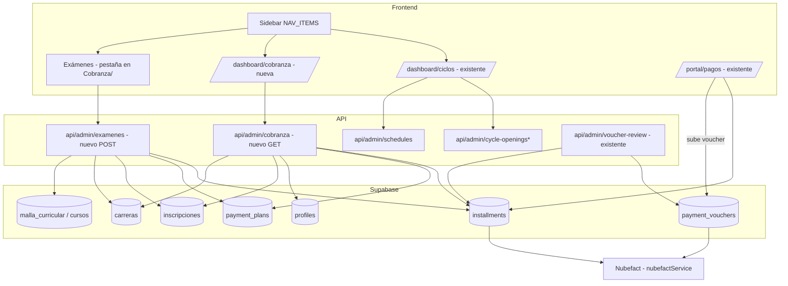
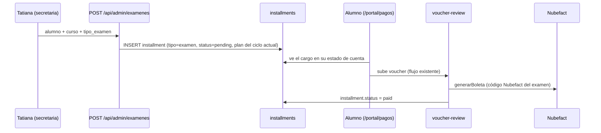

# Documento de Diseño

## Overview

Este módulo habilita al rol `secretaria_atencion_academica` (Tatiana) tres capacidades sobre el sistema existente (Next.js 15 App Router + Supabase, TypeScript):

1. **Ciclos y Horarios (existente):** solo cambios de permisos/visibilidad para dar acceso al módulo `/dashboard/ciclos` y sus endpoints.
2. **Cobranza (nueva):** página de solo lectura y endpoint `GET /api/admin/cobranza` para rastrear deuda de alumnos de CARRERA regular (excluyendo `tipo_programa = "actualizacion"`), con filtros por ciclo y carrera.
3. **Exámenes / Sustitutorios (nuevo, con facturación):** página + endpoint `POST /api/admin/examenes` para habilitar exámenes de pago manualmente, creando un cargo en `installments` que reutiliza el flujo existente de voucher → aprobación → Nubefact → estado de cuenta del alumno.

El diseño reutiliza deliberadamente los patrones existentes del proyecto y evita introducir nuevas abstracciones o tablas cuando no es necesario.

### Decisiones de diseño clave

- **El cargo de examen es un `installment`**, no una tabla nueva. Esto reutiliza TODO el flujo existente (voucher, aprobación en `voucher-review`, emisión Nubefact, estado de cuenta en `/portal/pagos`) sin duplicar lógica. Ver "Data Models".
- **La cobranza reutiliza el patrón de consultas de `contabilidad/route.ts`** (uniones `installments` → `payment_plans` → `profiles`, resolución de nombres por lote), adaptado a cuotas pendientes en lugar de pagadas.
- **La autorización reutiliza el patrón `verifyAccess`/`verifyStaff`** existente: lee `profiles.rol`, compara contra `ALLOWED_ROLES`, con fallback al email admin `admin@margaritacabrera.edu.pe`.
- **Los códigos Nubefact de examen quedan como PENDIENTE bloqueante** (ver "PENDIENTE: Códigos Nubefact de exámenes"), porque no se conocen aún y usar el valor por defecto (16 = MATRÍCULA) produciría boletas incorrectas.

## Architecture

### Diagrama de componentes



### Flujo del cargo de examen (extremo a extremo)



## Components and Interfaces

### 1. Cambios de permisos — Ciclos y Horarios (existente)

Añadir `"secretaria_atencion_academica"` sin quitar los roles actuales:

| Archivo | Cambio |
|---|---|
| `src/app/dashboard/ciclos/page.tsx` | `RouteGuard allowedRoles={["super_admin", "cycle_manager", "secretaria_atencion_academica"]}` |
| `src/app/api/admin/cycle-openings/route.ts` | `ALLOWED_ROLES = ["super_admin", "cycle_manager", "secretaria_atencion_academica"]` |
| `src/app/api/admin/cycle-openings/available/route.ts` | idem `ALLOWED_ROLES` |
| `src/app/api/admin/cycle-openings/close/route.ts` | idem `ALLOWED_ROLES` |
| `src/app/api/admin/schedules/route.ts` | idem `ALLOWED_ROLES` |
| `src/components/Sidebar.tsx` | En el ítem `/dashboard/ciclos`, agregar `"secretaria_atencion_academica"` a `roles` |

### 2. Endpoint de Cobranza (nuevo)

`GET /api/admin/cobranza`

**Autorización:** `verifyAccess` con `ALLOWED_ROLES = ["super_admin", "secretaria_atencion_academica"]` + fallback email admin. Respuesta 403 `{ error: "No autorizado" }` si no autorizado.

**Query params (opcionales):**
- `ciclo` (número): filtra por `inscripciones.ciclo_actual`.
- `carrera_id` (uuid): filtra por carrera.

**Lógica (adaptando `contabilidad/route.ts`):**
1. Obtener carreras de carrera regular: `carreras` con `tipo_programa <> 'actualizacion'`. Guardar el conjunto de `carrera_id` permitidos.
2. Obtener inscripciones activas de esos `carrera_id` (aplicando filtros `ciclo`/`carrera_id` si vienen): `inscripciones(alumno_id, carrera_id, ciclo_actual, estado)`.
3. Obtener `payment_plans(id, alumno_id, ciclo, year)` de esos alumnos.
4. Obtener `installments` de esos `plan_id` con `status NOT IN ('paid','exonerado')`, seleccionando `concepto, amount, due_date, status, plan_id`.
5. Resolver `profiles(id, nombre_completo)` por lote (patrón `alumnoMap` de contabilidad).
6. Agrupar por alumno: nombre, ciclo actual, lista de cuotas pendientes, `total_adeudado = Σ amount`.
7. Omitir alumnos sin cuotas pendientes.

**Forma de respuesta:**
```jsonc
{
  "alumnos": [
    {
      "alumno_id": "uuid",
      "nombre": "PEREZ GARCIA, MARIA",
      "carrera_id": "uuid",
      "carrera": "ASISTENCIA ADMINISTRATIVA",
      "ciclo_actual": 3,
      "cuotas": [
        { "concepto": "CUOTAS 02", "amount": 400.0, "due_date": "2026-05-01", "status": "pending" }
      ],
      "total_adeudado": 400.0
    }
  ],
  "resumen": { "total_alumnos": 1, "total_adeudado": 400.0 }
}
```

### 3. Página de Cobranza (nueva)

`src/app/dashboard/cobranza/page.tsx`, envuelta en `RouteGuard allowedRoles={["super_admin", "secretaria_atencion_academica"]}`.

- Encabezado claro ("Cobranza — Alumnos con deuda pendiente").
- Dos selectores: **Ciclo** y **Carrera** (poblados desde las opciones disponibles; la carrera puede leerse del endpoint académico existente o derivarse de la respuesta).
- Tabla/tarjetas por alumno: nombre, ciclo, total adeudado destacado, y detalle expandible de cuotas (concepto, monto, vencimiento).
- Estado vacío explícito cuando no hay morosos.
- Solo lectura: sin botones de acción sobre cuotas.
- Diseño intuitivo para usuaria no técnica (etiquetas en español claro, montos formateados en S/).

### 4. Endpoint de Exámenes (nuevo)

`POST /api/admin/examenes`

**Autorización:** `verifyAccess` con `ALLOWED_ROLES = ["super_admin", "secretaria_atencion_academica"]` + fallback email admin.

**Body:**
```jsonc
{ "alumno_id": "uuid", "curso_id": "uuid", "curso_nombre": "MATEMÁTICA", "tipo_examen": "sustitutorio" | "recuperacion" | "extraordinario" }
```

**Montos (conocidos):**
```ts
const MONTOS_EXAMEN = { sustitutorio: 50.0, recuperacion: 80.0, extraordinario: 100.0 };
const CONCEPTO_EXAMEN = { sustitutorio: "EXAMEN SUSTITUTORIO", recuperacion: "EXAMEN DE RECUPERACIÓN", extraordinario: "EXAMEN EXTRAORDINARIO" };
```

**Lógica:**
1. Validar `tipo_examen` ∈ {sustitutorio, recuperacion, extraordinario}.
2. Obtener la inscripción activa del alumno; verificar que su `carreras.tipo_programa <> 'actualizacion'`. Si es actualización → 400 con error explicativo (Req 8.9).
3. Obtener el `payment_plan` del ciclo actual del alumno (`payment_plans` con `alumno_id` y `ciclo = inscripciones.ciclo_actual`). Si no existe → 400 con error explicativo (Req 8.10).
4. Insertar en `installments`:
   ```ts
   {
     plan_id,
     tipo: "examen",
     numero: null,               // o un correlativo específico de examen
     concepto: `${CONCEPTO_EXAMEN[tipo_examen]} - ${curso_nombre}`,
     amount_original: MONTOS_EXAMEN[tipo_examen],
     amount: MONTOS_EXAMEN[tipo_examen],
     due_date: <fecha de vencimiento asignada>,
     status: "pending",
     fecha_pago: null,
   }
   ```
5. Responder `{ success: true, installment_id }`.

### 5. Página de Exámenes (nueva)

Se implementa como pestaña dentro de `/dashboard/cobranza` (o página `/dashboard/cobranza/examenes`), con el mismo `RouteGuard`.

- Selector de **alumno** (solo Alumno_Carrera; buscador predictivo estilo `ProfesorCombobox` existente en `ciclos/page.tsx`).
- Selector de **curso** poblado desde la malla del alumno (`malla_curricular` de su carrera / `cursos`).
- Selector de **tipo de examen** (3 opciones con su monto visible).
- Botón "Habilitar examen" → `POST /api/admin/examenes`.
- Confirmación visible del cargo creado y su monto.

## Data Models

### Representación del cargo de examen (decisión)

El cargo de examen se modela como una fila en la tabla existente **`installments`**, enlazada al `payment_plan` del ciclo actual del alumno. No se crea tabla nueva.

Campos usados (según `payment-service.ts` y `voucher-review/route.ts`):

| Campo | Valor para examen |
|---|---|
| `plan_id` | id del `payment_plan` del ciclo actual del alumno |
| `tipo` | `"examen"` (nuevo valor; hoy existen `"matricula"`, `"cuota"`) |
| `numero` | `null` (o correlativo de examen; no colisiona con cuotas 0–4) |
| `concepto` | `"EXAMEN SUSTITUTORIO - <curso>"` / `"EXAMEN DE RECUPERACIÓN - <curso>"` / `"EXAMEN EXTRAORDINARIO - <curso>"` |
| `amount_original` | 50 / 80 / 100 |
| `amount` | 50 / 80 / 100 |
| `due_date` | fecha de vencimiento asignada |
| `status` | `"pending"` |
| `fecha_pago` | `null` |

**Por qué reutilizar `installments`:**
- El estado de cuenta `/portal/pagos` lista `installments` por `payment_plan`/ciclo, por lo que el cargo aparece automáticamente al alumno (Req 9). El orden en `/portal/pagos` usa `CONCEPTO_ORDER[...] ?? 99`, así que conceptos de examen (desconocidos en ese mapa) se ordenan al final, sin romper nada.
- El Flujo_Voucher enlaza `payment_vouchers.installment_id` → `installments`, así que el alumno sube su voucher y el staff lo aprueba con la misma UI y lógica (Req 10).
- La aprobación en `voucher-review` emite la boleta con Nubefact y marca `status = "paid"`; el único punto que requiere atención es el **código de producto Nubefact** (ver PENDIENTE).

### Tablas involucradas (referencia)

- `installments(concepto, amount, amount_original, due_date, status, tipo, numero, plan_id, comprobante_*)`.
- `payment_plans(id, alumno_id, ciclo, year, status)`.
- `profiles(id, nombre_completo, rol, estado)` — nota: la columna de estado es `estado`, no `is_active`.
- `inscripciones(alumno_id, carrera_id, ciclo_actual, estado)`.
- `carreras(id, nombre_carrera, codigo, tipo_programa)` — `tipo_programa = "actualizacion"` se EXCLUYE.
- `malla_curricular(carrera_id, curso_id)` + `cursos(id, nombre_curso, ciclo_perteneciente)`.
- `payment_vouchers(installment_id, alumno_id, status, ...)`.

## PENDIENTE: Códigos Nubefact de exámenes (BLOQUEANTE)

Los códigos de producto Nubefact están **hardcodeados** en el código (no en BD). Hoy el mapa es:

```ts
// src/app/api/admin/voucher-review/route.ts  y
// src/app/api/admin/cron/generate-monthly-vouchers/route.ts
const NUBEFACT_CODES: Record<string, number> = {
  "MATRÍCULA": 16, "CUOTAS 01": 39, "CUOTAS 02": 40, "CUOTAS 03": 41, "CUOTAS 04": 42,
};
const codigoProducto = NUBEFACT_CODES[inst?.concepto ?? ""] ?? 16; // ⚠️ fallback = MATRÍCULA
```

**Problema:** los conceptos de examen no están en el mapa, por lo que el fallback usaría el código **16 (MATRÍCULA)**, produciendo una boleta con producto incorrecto.

**Los tres códigos Nubefact de examen NO se conocen aún.** El usuario debe proveerlos antes de facturar exámenes:

```ts
// PENDIENTE — completar antes de habilitar facturación de exámenes:
// "EXAMEN SUSTITUTORIO - ..."  → código Nubefact = ???
// "EXAMEN DE RECUPERACIÓN - ..." → código Nubefact = ???
// "EXAMEN EXTRAORDINARIO - ..."  → código Nubefact = ???
```

**Diseño de la resolución de código para exámenes:**
- Como el `concepto` incluye el nombre del curso, la búsqueda por igualdad exacta en `NUBEFACT_CODES` no funcionará. Se resolverá el código por **prefijo/tipo de examen** (ej. detectar `startsWith("EXAMEN SUSTITUTORIO")`) mapeado a su código.
- Mientras los códigos no estén definidos, la aprobación de un voucher de examen **NO debe** emitir con el código por defecto de MATRÍCULA (Req 11.3). La implementación de facturación de exámenes queda bloqueada hasta que el usuario provea los tres códigos.

## Error Handling

- **Autorización:** todos los endpoints nuevos responden `403 { error: "No autorizado" }` ante rol no permitido (patrón existente).
- **Validación de examen:** `tipo_examen` inválido → `400`; alumno de actualización → `400` explicativo; sin `payment_plan` del ciclo actual → `400` explicativo.
- **Errores de BD:** capturar y responder `500 { error: "Error interno", detail }` (patrón de `contabilidad/route.ts`).
- **Nubefact (exámenes):** si el código Nubefact del examen no está definido, evitar emitir con código incorrecto (ver PENDIENTE); reutilizar el manejo de error de Nubefact existente en `voucher-review`.

## Testing Strategy

Este módulo consiste principalmente en: cambios de permisos, un endpoint de consulta de solo lectura (CRUD/lectura) y la creación de una fila (`installment`) que reutiliza flujos existentes. No contiene funciones puras con propiedades universales de amplio espacio de entradas, por lo que **no se aplica testing basado en propiedades (PBT)**. Se usa una estrategia basada en ejemplos e integración.

### Tests unitarios (ejemplos y casos borde)
- **Autorización de endpoints:** para `GET /api/admin/cobranza` y `POST /api/admin/examenes`, verificar que un rol no autorizado recibe 403 y que `secretaria_atencion_academica`, `super_admin` y el email admin son autorizados.
- **Cobranza — filtro de carrera:** dado un conjunto con alumnos de carrera y de actualización, verificar que la respuesta excluye a los de `tipo_programa = "actualizacion"` (Req 5.3).
- **Cobranza — filtro de cuotas:** verificar que solo se incluyen cuotas con `status ∉ {paid, exonerado}` y que `total_adeudado` es la suma correcta (Req 5.4, 5.7).
- **Cobranza — filtros ciclo/carrera:** verificar que los parámetros `ciclo` y `carrera_id` restringen los resultados (Req 5.8, 5.9).
- **Examen — montos:** verificar que sustitutorio/recuperación/extraordinario crean cargos por 50/80/100 respectivamente (Req 8.3–8.5).
- **Examen — forma del installment:** verificar `tipo = "examen"`, `status = "pending"`, `plan_id` del ciclo actual y `concepto` con tipo + curso (Req 8.6, 8.7).
- **Examen — rechazo de actualización:** verificar 400 si el alumno es de un Programa_Actualizacion (Req 8.9).
- **Examen — sin plan:** verificar 400 si no hay `payment_plan` del ciclo actual (Req 8.10).

### Tests de integración
- **Visibilidad en estado de cuenta:** crear un Cargo_Examen y verificar que aparece en la carga de `/portal/pagos` del alumno para su ciclo (Req 9).
- **Facturación reutilizada (tras definir códigos Nubefact):** con Nubefact mockeado, aprobar el voucher de un Cargo_Examen y verificar que `installments.status` pasa a `"paid"` y se guardan los datos del comprobante (Req 10). Este test queda bloqueado hasta que los códigos Nubefact de examen estén definidos.

### Verificación de build
- `npx tsc --noEmit` y `npm run build` deben pasar tras cada bloque de cambios.
