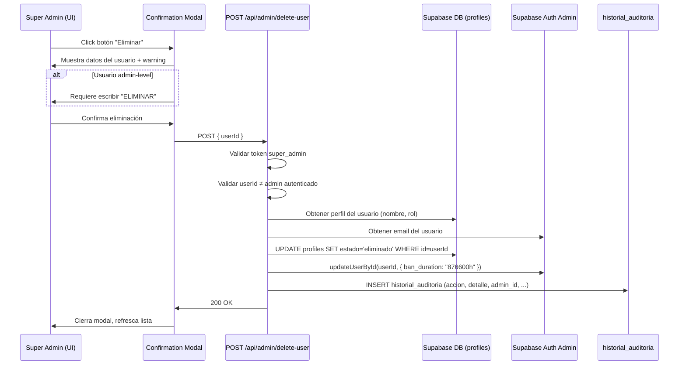

# Documento de Diseño — User Soft Delete

## Resumen (Overview)

Esta funcionalidad implementa un mecanismo de "eliminación suave" (soft delete) para usuarios en el panel de administración de Gestión de Usuarios. En lugar de eliminar físicamente registros, el sistema marca al usuario con `estado = 'eliminado'` en la tabla `profiles`, banea su cuenta de Supabase Auth para impedir el login, y registra la acción en la tabla de auditoría. Toda la data histórica (inscripciones, historial de ciclos, cursos de alumno) se preserva intacta.

### Decisiones clave del usuario
1. El estado `eliminado` es **definitivo** — no hay restauración desde la UI. Solo reversible directamente desde Supabase.
2. Roles administrativos (`super_admin`, `staff_tramites`, `gestor`, `actualizacion`) requieren confirmación extra: escribir "ELIMINAR".
3. Campos de auditoría: `accion="eliminar_usuario"`, `admin_id`, `admin_email`, `target_id`, `detalle={nombre_completo, email, rol}`, `created_at` (auto).

### Alcance
- Migración de BD: agregar `'eliminado'` al CHECK constraint de `profiles.estado`
- Nuevo endpoint API: `POST /api/admin/delete-user`
- Modificación del endpoint de listado: `/api/admin/users` (ya retorna todos, sin cambios necesarios)
- Protección del endpoint toggle: rechazar `'eliminado'`
- UI: botón Eliminar, modal de confirmación, filtro por estado, badge gris

## Arquitectura

### Diagrama de flujo del soft delete



### Diagrama de componentes

```mermaid
graph TD
    subgraph Frontend
        A[usuarios/page.tsx] --> B[DeleteUserModal]
        A --> C[EstadoFilter]
        A --> D[Users Table]
    end

    subgraph API Routes
        E[/api/admin/delete-user] --> F[supabase-admin.ts]
        G[/api/admin/toggle-user] --> F
        H[/api/admin/users] --> F
    end

    subgraph Database
        I[profiles]
        J[historial_auditoria]
        K[inscripciones]
        L[historial_ciclos]
        M[alumno_cursos]
    end

    E --> I
    E --> J
    E --> F
    F --> N[Supabase Auth Admin API]
    G --> I
    H --> I
```

## Componentes e Interfaces

### 1. Endpoint API: `POST /api/admin/delete-user`

**Archivo:** `src/app/api/admin/delete-user/route.ts`

**Responsabilidad:** Procesar solicitudes de soft-delete de usuarios.

**Interfaz de entrada:**
```typescript
// Request body
interface DeleteUserRequest {
  userId: string; // UUID del usuario a eliminar
}

// Headers requeridos
// Authorization: Bearer <access_token>
```

**Interfaz de salida:**
```typescript
// Éxito (200)
interface DeleteUserSuccess {
  success: true;
}

// Error (400 | 403 | 500)
interface DeleteUserError {
  error: string;
}
```

**Lógica del endpoint (en orden):**
1. Extraer y validar token de autorización → verificar que el email sea `admin@margaritacabrera.edu.pe` → 403 si no
2. Parsear body y validar `userId` presente y no vacío → 400 si falta
3. Verificar que `userId !== admin.id` (prevenir auto-eliminación) → 400 si coincide
4. Consultar perfil del usuario target: `nombre_completo`, `rol` desde `profiles`
5. Consultar email del usuario target desde Supabase Auth Admin API
6. Actualizar `profiles.estado = 'eliminado'` WHERE `id = userId`
7. Si falla el UPDATE → 500 con mensaje de error de BD
8. Banear cuenta Auth: `supabaseAdmin.auth.admin.updateUserById(userId, { ban_duration: "876600h" })`
9. Si falla el ban → retornar error (incluso si el UPDATE fue exitoso)
10. Insertar registro de auditoría en `historial_auditoria`
11. Retornar `{ success: true }`

### 2. Protección del endpoint toggle existente

**Archivo:** `src/app/api/admin/toggle-user/route.ts`

**Cambio:** Agregar validación para rechazar `estado === 'eliminado'`.

```typescript
// Agregar después de la validación de datos incompletos:
if (estado === "eliminado") {
  return NextResponse.json(
    { error: "No se puede usar este endpoint para eliminar usuarios" },
    { status: 400 }
  );
}
```

### 3. Componente UI: Modal de Confirmación de Eliminación

**Ubicación:** Inline en `src/app/dashboard/usuarios/page.tsx` (siguiendo el patrón existente del modal de creación)

**Props/Estado:**
```typescript
interface DeleteModalState {
  show: boolean;
  targetUser: Profile | null;
  confirmText: string;    // Para roles admin-level
  deleting: boolean;      // Loading state
}
```

**Comportamiento:**
- Para `Regular_User` (alumno, profesor): muestra nombre, email, rol y warning. Botón "Eliminar" habilitado directamente.
- Para `Admin_Level_User` (super_admin, staff_tramites, gestor, actualizacion): muestra warning adicional prominente + input para escribir "ELIMINAR". Botón habilitado solo cuando `confirmText === "ELIMINAR"`.
- Botón "Cancelar" cierra sin acción.
- Durante la petición: botón deshabilitado + spinner.

### 4. Filtro de Estado en la UI

**Ubicación:** `src/app/dashboard/usuarios/page.tsx`

**Estado nuevo:**
```typescript
const [filtroEstado, setFiltroEstado] = useState("todos");
```

**Lógica de filtrado:**
- `"todos"` → muestra `activo` + `inactivo` (excluye `eliminado`)
- `"activo"` → solo `activo`
- `"inactivo"` → solo `inactivo`
- `"eliminado"` → solo `eliminado`

**Opciones de pills:** `todos`, `activo`, `inactivo`, `eliminado`

### 5. Badge de Estado "Eliminado"

**Estilo:** Usa la clase `badge-gray` ya existente en `globals.css` (`bg-gray-100 text-gray-600`).

**Cambio en la tabla:** Actualizar la lógica del badge de estado para soportar tres estados:
```typescript
// Antes:
p.estado === "activo" ? "badge-green" : "badge-red"

// Después:
p.estado === "activo" ? "badge-green" : p.estado === "eliminado" ? "badge-gray" : "badge-red"
```

### 6. Visibilidad condicional de botones de acción

Para filas con `estado === 'eliminado'`:
- **Ocultar** botón de toggle (activar/desactivar)
- **Ocultar** botón de eliminar
- **Mantener visible** botón de reset password (decisión: no es necesario ocultarlo, el usuario ya está baneado)

Para la fila del super_admin autenticado:
- **Ocultar** botón de eliminar (prevención de auto-eliminación en UI)

## Modelos de Datos

### Cambio en tabla `profiles`

```sql
-- Eliminar constraint actual
ALTER TABLE public.profiles DROP CONSTRAINT IF EXISTS profiles_estado_check;

-- Agregar constraint actualizado
ALTER TABLE public.profiles ADD CONSTRAINT profiles_estado_check
  CHECK (estado IN ('activo', 'inactivo', 'eliminado'));
```

**Impacto:** Ninguno en registros existentes. Solo agrega un valor válido adicional.

### Tabla `historial_auditoria` (sin cambios estructurales)

Registro de auditoría para soft delete:
```json
{
  "id": "uuid-auto",
  "accion": "eliminar_usuario",
  "admin_id": "uuid-del-super-admin",
  "admin_email": "admin@margaritacabrera.edu.pe",
  "target_id": "uuid-del-usuario-eliminado",
  "detalle": {
    "nombre_completo": "JUAN PÉREZ GARCÍA",
    "email": "jperez@margaritacabrera.edu.pe",
    "rol": "alumno"
  },
  "created_at": "2025-01-15T10:30:00Z"
}
```

### Tablas relacionadas (sin cambios)

Las siguientes tablas **no se modifican**. El soft delete solo actualiza `profiles.estado` — no ejecuta DELETE, por lo que los FK con `ON DELETE CASCADE` no se activan:

| Tabla | FK | Efecto del soft delete |
|---|---|---|
| `inscripciones` | `alumno_id → auth.users(id)` | Ninguno — registros preservados |
| `historial_ciclos` | `alumno_id → auth.users(id)` | Ninguno — registros preservados |
| `alumno_cursos` | `alumno_id → profiles(id)` | Ninguno — registros preservados |

### Interfaz TypeScript del Profile (actualizada)

```typescript
interface Profile {
  id: string;
  nombre_completo: string;
  email: string;
  rol: string;
  estado: "activo" | "inactivo" | "eliminado";
  dni: string | null;
  created_at: string;
}
```

### Constantes de roles admin-level

```typescript
const ADMIN_LEVEL_ROLES = ["super_admin", "staff_tramites", "gestor", "actualizacion"];
```

Usada en el modal para determinar si se requiere confirmación extra (escribir "ELIMINAR").

## Correctness Properties

*Una propiedad es una característica o comportamiento que debe cumplirse en todas las ejecuciones válidas de un sistema — esencialmente, una declaración formal sobre lo que el sistema debe hacer. Las propiedades sirven como puente entre especificaciones legibles por humanos y garantías de corrección verificables por máquina.*

### Property 1: Transición de estado a eliminado

*Para cualquier* usuario con `estado` igual a `activo` o `inactivo`, al ejecutar la operación de soft-delete, el `estado` del usuario en la tabla `profiles` debe cambiar a `eliminado`.

**Validates: Requirements 2.2**

### Property 2: Rechazo de autorización para no-admins

*Para cualquier* dirección de email que no sea `admin@margaritacabrera.edu.pe`, una solicitud al endpoint de soft-delete debe retornar HTTP 403.

**Validates: Requirements 2.3**

### Property 3: Rechazo de userId inválido

*Para cualquier* valor de `userId` que sea vacío, nulo, o compuesto solo de espacios en blanco, el endpoint de soft-delete debe retornar HTTP 400 con un mensaje descriptivo.

**Validates: Requirements 2.4**

### Property 4: Ban de Auth con parámetros correctos

*Para cualquier* usuario que sea soft-deleted exitosamente, el sistema debe invocar `updateUserById` de Supabase Auth Admin con el `userId` correcto y `ban_duration: "876600h"`.

**Validates: Requirements 2.6, 7.1**

### Property 5: Registro de auditoría completo

*Para cualquier* usuario soft-deleted exitosamente, el registro insertado en `historial_auditoria` debe contener: `accion = "eliminar_usuario"`, `admin_id` del super_admin autenticado, `admin_email` del super_admin, `target_id` del usuario eliminado, y un campo `detalle` JSON con `nombre_completo`, `email` y `rol` del usuario al momento de la eliminación.

**Validates: Requirements 3.1, 3.2, 3.3**

### Property 6: Preservación de datos históricos

*Para cualquier* usuario con registros asociados en `inscripciones`, `historial_ciclos` y `alumno_cursos`, después de ejecutar el soft-delete, la cantidad y contenido de esos registros debe permanecer exactamente igual, y el registro del usuario en `profiles` debe seguir existiendo.

**Validates: Requirements 4.1, 4.2, 4.3, 4.4**

### Property 7: Botones de acción ocultos para usuarios eliminados

*Para cualquier* usuario con `estado = 'eliminado'`, la fila en la tabla de usuarios no debe renderizar ni el botón "Eliminar" ni el botón de toggle (activar/desactivar).

**Validates: Requirements 5.3, 10.2**

### Property 8: Modal muestra información del usuario

*Para cualquier* usuario regular (alumno o profesor), al abrir el modal de confirmación de eliminación, el modal debe mostrar el `nombre_completo`, `email` y `rol` del usuario target.

**Validates: Requirements 6.1**

### Property 9: Confirmación extra para roles administrativos

*Para cualquier* cadena de texto ingresada en el campo de confirmación del modal para un usuario admin-level, el botón de confirmar solo debe estar habilitado cuando la cadena sea exactamente `"ELIMINAR"`.

**Validates: Requirements 6.4**

### Property 10: Filtro de estado correcto

*Para cualquier* conjunto de usuarios con estados mixtos (`activo`, `inactivo`, `eliminado`) y cualquier valor de filtro seleccionado:
- `"todos"` debe mostrar exactamente los usuarios con `activo` e `inactivo`, excluyendo `eliminado`
- `"activo"` debe mostrar exactamente los usuarios con `activo`
- `"inactivo"` debe mostrar exactamente los usuarios con `inactivo`
- `"eliminado"` debe mostrar exactamente los usuarios con `eliminado`

**Validates: Requirements 8.3, 8.4, 8.5**

### Property 11: Toggle rechaza estado eliminado

*Para cualquier* solicitud al endpoint `/api/admin/toggle-user` con `estado = "eliminado"`, el endpoint debe retornar HTTP 400 y no modificar ningún registro.

**Validates: Requirements 10.1, 10.3**

## Manejo de Errores

### Errores del endpoint `POST /api/admin/delete-user`

| Escenario | HTTP Status | Mensaje | Acción |
|---|---|---|---|
| Token ausente o inválido | 403 | `"No autorizado"` | Rechazar sin procesar |
| Email no es super_admin | 403 | `"No autorizado"` | Rechazar sin procesar |
| `userId` faltante o vacío | 400 | `"userId es requerido"` | Rechazar sin procesar |
| `userId` es el propio admin | 400 | `"No puedes eliminar tu propia cuenta"` | Rechazar sin procesar |
| Perfil del usuario no encontrado | 400 | `"Usuario no encontrado"` | Rechazar sin procesar |
| Fallo en UPDATE de profiles | 500 | Mensaje de error de Supabase | No se intenta ban ni auditoría |
| Fallo en ban de Auth | 500 | `"Error al banear la cuenta de autenticación"` | El estado ya fue actualizado — se reporta el error |
| Fallo en insert de auditoría | — | Se ignora silenciosamente | El soft-delete ya se completó; la auditoría es best-effort |

### Errores del endpoint `POST /api/admin/toggle-user` (cambio)

| Escenario | HTTP Status | Mensaje |
|---|---|---|
| `estado === "eliminado"` | 400 | `"No se puede usar este endpoint para eliminar usuarios"` |

### Errores en la UI

- **Error de red / API**: Se muestra en el banner de error existente (`bg-red-50 border border-red-200 text-red-700`).
- **Error durante soft-delete**: El modal muestra el error y mantiene el botón habilitado para reintentar.
- **Timeout**: No se implementa timeout especial — se usa el comportamiento por defecto de `fetch`.

### Orden de operaciones y atomicidad

La operación de soft-delete **no es atómica** entre Supabase DB y Supabase Auth. El orden es:
1. UPDATE profiles → 2. Ban Auth → 3. Insert auditoría

Si el paso 2 falla, el usuario queda con `estado = 'eliminado'` pero su cuenta Auth no está baneada. El endpoint retorna error para que el admin pueda reintentar o intervenir manualmente. Esto es aceptable porque:
- El usuario ya no aparece como activo en la UI
- El admin recibe notificación del fallo parcial
- La corrección manual desde Supabase es posible

## Estrategia de Testing

### Enfoque dual

Esta funcionalidad se beneficia de un enfoque combinado:

1. **Tests unitarios (example-based)**: Para escenarios específicos, edge cases y errores concretos
2. **Tests de propiedades (property-based)**: Para validar comportamientos universales con inputs generados

### Librería de property-based testing

**Librería:** [fast-check](https://github.com/dubzzz/fast-check) — la librería estándar de PBT para TypeScript/JavaScript.

**Framework de test:** [Vitest](https://vitest.dev/) — compatible con el ecosistema Next.js del proyecto.

**Configuración:** Cada test de propiedad ejecutará mínimo 100 iteraciones.

### Tests de propiedades (PBT)

Cada propiedad del documento de diseño se implementará como un test de propiedad individual:

| Propiedad | Tag | Descripción |
|---|---|---|
| Property 1 | `Feature: user-soft-delete, Property 1: Transición de estado a eliminado` | Genera usuarios random con estado activo/inactivo, ejecuta soft-delete, verifica estado = eliminado |
| Property 2 | `Feature: user-soft-delete, Property 2: Rechazo de autorización para no-admins` | Genera emails random no-admin, verifica 403 |
| Property 3 | `Feature: user-soft-delete, Property 3: Rechazo de userId inválido` | Genera strings vacíos/whitespace, verifica 400 |
| Property 4 | `Feature: user-soft-delete, Property 4: Ban de Auth con parámetros correctos` | Genera usuarios random, verifica llamada a ban con parámetros exactos |
| Property 5 | `Feature: user-soft-delete, Property 5: Registro de auditoría completo` | Genera usuarios random, verifica estructura completa del registro de auditoría |
| Property 6 | `Feature: user-soft-delete, Property 6: Preservación de datos históricos` | Genera usuarios con datos relacionados, verifica que no se eliminan |
| Property 9 | `Feature: user-soft-delete, Property 9: Confirmación extra para roles administrativos` | Genera strings random, verifica que solo "ELIMINAR" habilita el botón |
| Property 10 | `Feature: user-soft-delete, Property 10: Filtro de estado correcto` | Genera listas de usuarios con estados mixtos, verifica filtrado correcto |
| Property 11 | `Feature: user-soft-delete, Property 11: Toggle rechaza estado eliminado` | Verifica que toggle con estado=eliminado retorna 400 |

### Tests unitarios (example-based)

| Criterio | Tipo | Descripción |
|---|---|---|
| 2.5 | EXAMPLE | Mock fallo de BD → verifica 500 |
| 2.7 | EXAMPLE | Mock fallo de ban → verifica error response |
| 5.1 | EXAMPLE | Verifica presencia del botón Eliminar con icono Trash |
| 5.4 | EXAMPLE | Click en Eliminar abre modal sin llamar API |
| 6.2 | EXAMPLE | Modal para usuario regular muestra warning |
| 6.5 | EXAMPLE | Click en Cancelar cierra modal sin acción |
| 6.7 | EXAMPLE | Durante request: botón deshabilitado + spinner |
| 8.6 | EXAMPLE | Badge eliminado usa clase badge-gray |
| 9.1 | EXAMPLE | Auto-eliminación retorna 400 |
| 9.2 | EXAMPLE | Botón Eliminar oculto para fila del admin autenticado |

### Tests de integración

| Criterio | Descripción |
|---|---|
| 7.2 | Login con usuario baneado es rechazado por Supabase Auth |
| 6.6 | Confirmar eliminación → API llamada → lista refrescada |

### Estructura de archivos de test

```
src/
  __tests__/
    api/
      delete-user.test.ts          # Tests unitarios + PBT del endpoint
      toggle-user-guard.test.ts    # Test de protección del toggle
    ui/
      delete-modal.test.ts         # Tests del modal de confirmación
      estado-filter.test.ts        # Tests del filtro de estado
      action-buttons.test.ts       # Tests de visibilidad de botones
```

### Mocking strategy

- **Supabase DB**: Mock de `supabaseAdmin.from().update()`, `.insert()`, `.select()`
- **Supabase Auth**: Mock de `supabaseAdmin.auth.admin.updateUserById()`, `.listUsers()`
- **Auth token**: Mock de `supabase.auth.getUser()` para simular diferentes roles
- **Generadores fast-check**: Generadores custom para `Profile`, `userId`, `email`, `estado`

